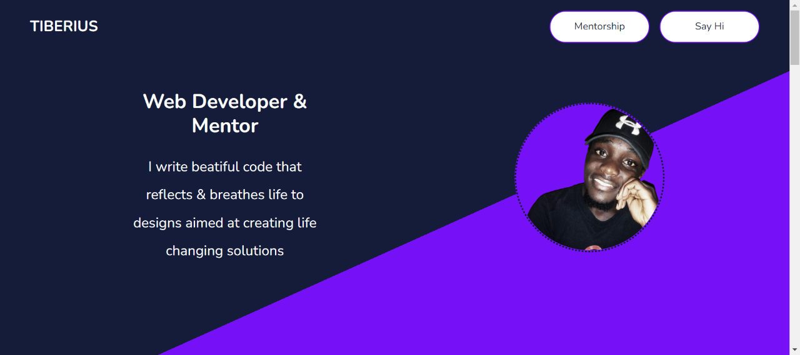
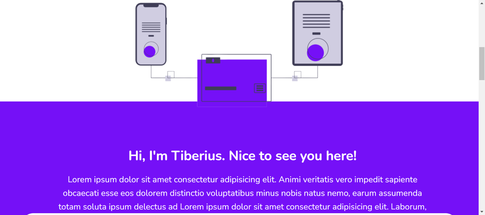
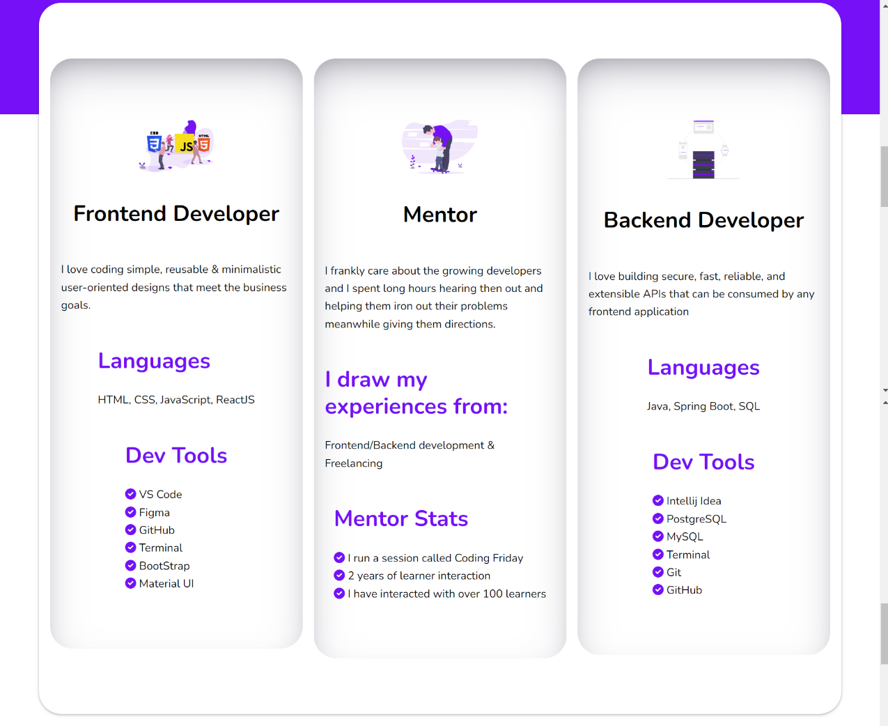
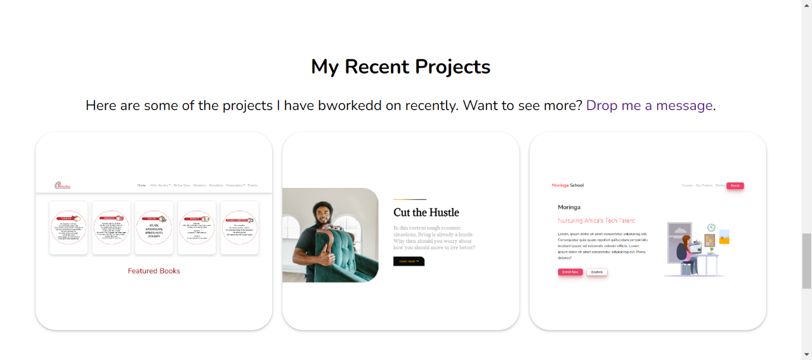
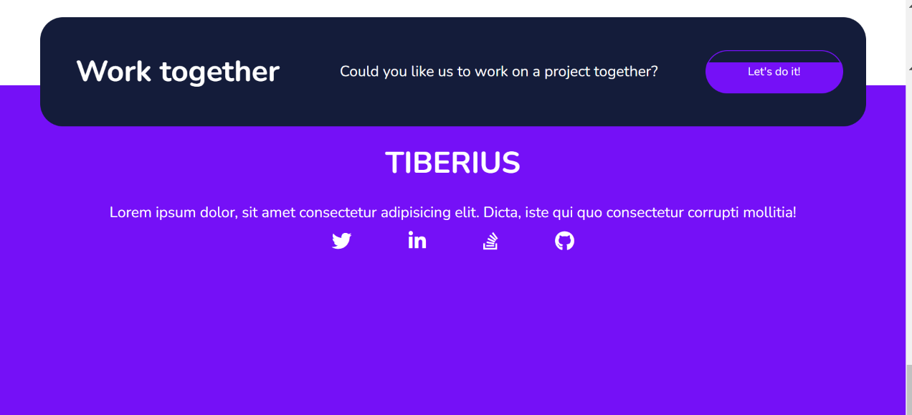

# Tiberius
#### This is my portfolio website that showcases my skills and previous projects as well as contact details, 05/06/2022

#### By Tiberius Mairura

## Landing Section

## About Section

## Skills  Section

## Projects Section

## Footer Section

## Table of Content
- [Tiberius](#tiberius)
      - [This is my portfolio website that showcases my skills and previous projects as well as contact details, 05/06/2022](#this-is-my-portfolio-website-that-showcases-my-skills-and-previous-projects-as-well-as-contact-details-05062022)
      - [By Tiberius Mairura](#by-tiberius-mairura)
  - [Landing Section](#landing-section)
  - [About Section](#about-section)
  - [Skills  Section](#skills--section)
  - [Projects Section](#projects-section)
  - [Footer Section](#footer-section)
  - [Table of Content](#table-of-content)
  - [Description](#description)
  - [Features](#features)
    - [Requirements](#requirements)
    - [Installation Process](#installation-process)
    - [Live Link](#live-link)
  - [Technologies Used](#technologies-used)
  - [Known Bugs](#known-bugs)
  - [Licence](#licence)
  - [Author's Details](#authors-details)

## Description

This is a responsive page built using plain HTML, CSS and JavaScript to showcase my skills and previous projects as well as contact details.

[Go Back to the top](#tiberius)

## Features
As a user you should be able to see:
1. My basic contact information
2. My skills
3. Prev projects

[Go Back to the top](#tiberius)
 ###  Requirements
 * Access to  a computer, mobile phone or any other garget
 * Internet access
### Installation Process
****
* Clone to this repo by running the command : git clone https://github.com/hermitex/tiberius.git
* Unzip the downloaded files in a folder of choice.
* Open the index.html file from the zipped file with any browser.
 ****
[Go Back to the top](#tiberius)
### Live Link
- Click this link to view the live application https://hermitex.github.io/tiberius/
## Technologies Used
* HTML - Crating the structure of the page
* CSS - Styling the page
* JavaScript - For adding functionality and dynamic to the page

[Go Back to the top](#tiberius)
## Known Bugs
* The page might not be fully responsive

## Licence
MIT License
Copyright (c) [2022] [Tiberius Mairura]
Permission is hereby granted, free of charge, to any person obtaining a copy
of this software and associated documentation files (the "Software"), to deal
in the Software without restriction, including without limitation the rights
to use, copy, modify, merge, publish, distribute, sublicense, and/or sell
copies of the Software, and to permit persons to whom the Software is
furnished to do so, subject to the following conditions:
The above copyright notice and this permission notice shall be included in all
copies or substantial portions of the Software.
THE SOFTWARE IS PROVIDED "AS IS", WITHOUT WARRANTY OF ANY KIND, EXPRESS OR
IMPLIED, INCLUDING BUT NOT LIMITED TO THE WARRANTIES OF MERCHANTABILITY,
FITNESS FOR A PARTICULAR PURPOSE AND NONINFRINGEMENT. IN NO EVENT SHALL THE
AUTHORS OR COPYRIGHT HOLDERS BE LIABLE FOR ANY CLAIM, DAMAGES OR OTHER
LIABILITY, WHETHER IN AN ACTION OF CONTRACT, TORT OR OTHERWISE, ARISING FROM,
OUT OF OR IN CONNECTION WITH THE SOFTWARE OR THE USE OR OTHER DEALINGS IN THE
SOFTWARE.

[Go Back to the top](#tiberius)

## Author's Details
Feel free to reach out via:
* StackOverflow Profile - [Tiberius Mairura](https://stackoverflow.com/users/11869442/tiberius)
* Linked - [Tiberius Mairura](https://www.linkedin.com/in/tiberius-mairura/)

[Go Back to the top](#tiberius)
